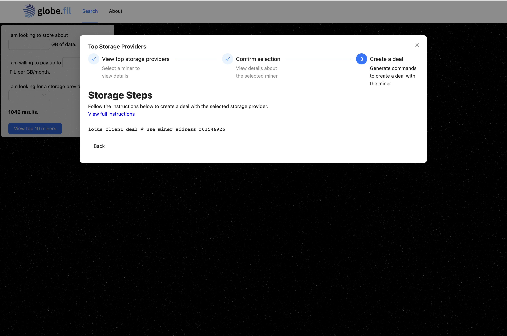
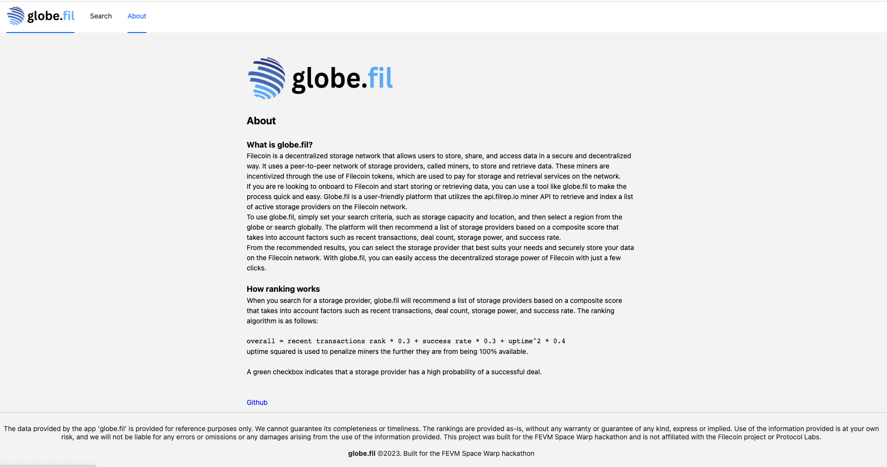

 

    

Globe.fil
----

Find the perfect Filecoin storage provider for your needs with globe.fil

Fitting in with the space theme - Globe.fil is built for the FEVM 2023 Space warp hackathon and going after the overall and best discovery tool categories.

Deployed on Spheron here: https://bafybeiev6yhzoaoq3b7xfvecalkkh5ctyu3hdckb7o57adjcgzv3sig37q.ipfs.sphn.live/

Demo video:

Creating a deal: https://docs.filecoin.io/get-started/store-and-retrieve/store-data/#create-a-deal

### Filecoin primer

Filecoin is a decentralized storage network that allows users to store, share, and access data in a secure and decentralized way. It uses a peer-to-peer network of storage providers, called miners, to store and retrieve data. These miners are incentivized through the use of Filecoin tokens, which are used to pay for storage and retrieval services on the network.

### Motivation

Visualization tools like https://plus.fil.org/miners/ and https://filscan.io/ exist, however have a lot of extra information - and they aren't necessarily focused on the business problem of storage for the common user. It's possible that, instead, I'm simply interested in figuring out the fastest (and most optimal price-wise) way to store a given volume of data on Filecoin.

Globe.fil makes the process of discovering the best miners quick and easy. Globe.fil is a user-friendly platform that utilizes the api.filrep.io miner API to retrieve and index a list of active storage providers on the Filecoin network.

To use globe.fil, simply set your search criteria, such as storage capacity and location, and then select a region from the globe or search globally. The platform will then recommend a list of storage providers based on a composite score that takes into account factors such as recent transactions, deal count, storage power, and success rate.

From the recommended results, you can select the storage provider that best suits your needs and securely store your data on the Filecoin network. With globe.fil, you can easily access the decentralized storage power of Filecoin with just a few clicks.

### How to run
`yarn dev`

The app should now be running on port 3000.

### Screenshots

### Home

### Search

### Step 1

### Step 2

### Step 3

### About

### Future work

1. Integration with other decentralized networks: An app like globe.fil could potentially integrate with other decentralized networks, such as IPFS or Ethereum, to provide a seamless experience for storing and accessing data across multiple platforms.

2. Advanced search and filtering options: Additional search and filtering options could be added to the app, such as the ability to search for specific file types, data retention policies, or pricing models.

3. Real-time monitoring and reporting: The app could include real-time monitoring and reporting features, such as the ability to track storage usage, data transfer speeds, and miner performance.

4.  Automated data replication: The app could include automated data replication features, such as the ability to automatically copy data to multiple storage providers for added redundancy and security.

Support for decentralized applications: The app could potentially provide integration and support for decentralized applications built on top of the Filecoin network, such as decentralized marketplaces, data sharing platforms, or distributed compute networks.

<!--

Demo flow:
- Show existing tools:
    https://filmine.io: 
    https://filscan.io/: A lot of unnecessary info
    https://plus.fil.org/miners/: Not sure what to do with this information.
- Drawbacks
- Wanted to create a tool that focused on the business value of filecoin
- Prefills a script for uploading files.

🛠 Discovery tools: Best use of FVM to improve transparency around Filecoin economy participants (e.g., storage providers, storage clients etc.).

Example projects may build trustless reputation systems, retrievability oracles, block explorers and more.

-->